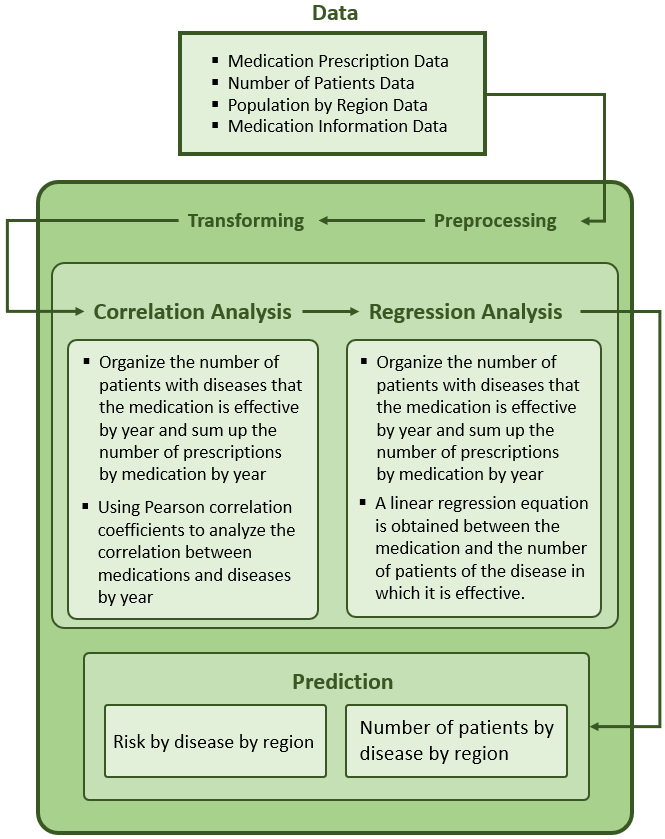
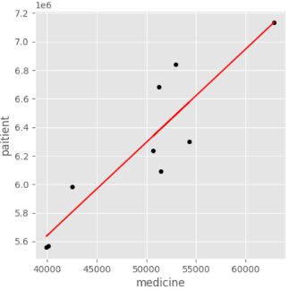

# 
 A Prediction of Number of Patients and Risk of Disease   in Each Region Based on Pharmaceutical Prescription Data 

    

### Contents
1. [Overview](#overview)
2. [Requirements](#requirements)
3. [Languages and Development Tools](#languages-and-development-tools)
4. [Architecture](#architecture)
5. [Data](#data)
6. [Repository Explaination](#repository-explaination)
7. [Result](#result)
8. [Conclusion](#conclusion)
9. [Reference](#reference)
10. [Developer](#developer)

### Overview

In the news and various materials, the number of patients with a specific disease by region is statistical data from national health examination data. And it is not accurate data because not only the entire population does not participate, but also only those over a certain age regularly participate. In addition, there are many statistics on the number of patients divided by age, sex, etc., but statistics on the number of patients divided by region can only be found about the most common diseases.  

In this study, we predict the number of patients by region in 2018 for specific diseases. In addition, based on the number of analyzed patients, we predict the risk of occurrence of the disease by region and derive implications for the risk of the disease by region. For data analysis, we used drug prescription data from 2010 to 2017 of Korea, and predict the number of patients by region applying the 2018 drug prescription data through correlation analysis and regression analysis.  
  
First, we figure out the degree of association between a specific drug and various diseases for which the drug is effective through correlation analysis using Pearson's correlation coefficient. Thereafter, we obtain a linear regression equation that calculates the expected total number of patients with a disease highly related to the corresponding drug based on the number of prescriptions for the drug through a linear regression analysis between drugs and diseases with a high degree of relatedness. Finally, we substitute the number of drug prescriptions in 2018, the most recent data, into the linear regression equation and predict the number of patients with specific diseases in 2018 by region using a specific weight concept. Also we calculate the disease risk obtained by comparing with other regions. This project was carried out as an assignment at Kyung Hee University.  
  
뉴스 및 각종 자료의 지역별 특정 질병의 환자 수는 국민건강검진자료로부터 통계된 자료로, 온 국민이 참여하지 않을 뿐더러 특정 연령 이상만 정기적으로 참여하기 때문에 정확한 자료가 아니다. 또한, 연령, 성별 등을 기준으로 나뉘어진 환자 수 통계는 많이 있지만, 지역을 기준으로 나뉘어진 환자 수 통계는 흔한 질병의 자료만 찾아볼 수 있다.  

본 연구에서는 특정 질병들의 2018년 지역별 환자 수를 예측한다. 또, 분석한 환자 수를 바탕으로 해당 질병에 대한 발생 위험도를 지역별로 예측하여 지역별로 질병에 대한 위험도의 시사점을 도출한다. 데이터 분석을 위해 대한민국의 2010년에서 2017년까지의 의약품 처방 데이터를 기반으로 상관분석과 회귀분석을 통해 가장 최근 데이터인 2018년 의약품 처방 데이터를 적용시켜 지역별 환자 수를 예측한다.  

상관분석과 회귀분석을 이용하여 결과를 도출하는 방법은 다음과 같다. 먼저, Pearson 상관계수를 이용한 상관분석을 통해 특정 의약품과 해당 의약품이 효과를 발휘하는 여러가지 질병들과의 연관된 정도(r)를 파악한다. 이후 연관된 정도가 높게 대응되는 의약품과 질병끼리의 선형회귀분석을 통해 의약품 처방건수를 바탕으로 해당 의약품과 연관성이 높은 질병의 예상 총 환자수를 산출하는 선형회귀식을 얻는다. 선형회귀식에 가장 최근 데이터인 2018년도 의약품 처방건수 데이터를 대입하고 가중치 개념을 도입하여 2018년 지역별 특정 질병들의 환자수를 예측하고 마지막으로 다른지역과 비교하여 얻어진 질병 발생 위험도를 산출한다.

### Requirements
+ Python 3.6

### Languages and Development Tools
  
 

### Architecture

   

### Data
+ 2010-2018 Pharmaceutical Prescription data (2010-2018 의약품 처방 데이터, 공공데이터포털, https://www.data.go.kr/index.do)
+ 2010-2018 Number of patients by 500 diseases with high frequency (2010-2018 다빈도 500가지 질병별 환자 수, 보건의료빅데이터개방시스템, https://opendata.hira.or.kr/home.do)
+ 2010-2018 Population by region (2010-2018 지역별 총 인구 수, 통계청, https://kostat.go.kr/portal/korea/index.action)
+ Region Code (지역코드)
 

### Repository Explaination
###### 📄 correlation.py  Correlation analysis between medicine and disease
###### 📄 preprocessing.py  Data preprocessing
###### 📄 prediction.py  Prediction of the number of patients by disease using linear regression and weight formula
###### 📄 regression.ipynb  Regressiong analysis for prediction of the number of patients using 
###### 📄 transformation.py  Data transforming
 

### Result
[[📽 Demo Video]](https://drive.google.com/file/d/1ZGazFyvy2vYYvYeUUHTiIFpL_58SCBsb/view?usp=share_link)

#### Example) Result of Correlation Analysis and Regression Analysis
+ Pearson correlation coefficient(r) between '428901ATB' and Acute Bronchitis  
	r = 0.619
+ Linear regression equation to calculate expected number of Allergic Rhinitis patients by region  
	y = 65.44x + 3022790.16  
	(x = Number of prescriptions, y= # of patients) 
	

 

#### Prediction the number of patients and risk by region using the number of drug ‘428901ATB’ prescriptions
(rounded off the first decimal place)
+ Acute Bronchitis 급성기관지염 

|Region|Predicted the Number of Patients|Predicted Risk|Region|Predicted the Number of Patients|Predicted Risk|
|:---:|:---|:---|:---:|:---|:---|
|서울|882275|Low|경기도|1002957|Medium|
|부산|959668|Low|강원도|875971|Low|
|대구|832368|Medium|충청남도|1175118|High|
|인천|1037588|Medium|충청북도|1229743|High|
|광주|999680|Medium|전라남도|1097908|High|
|대전|1280635|High|전라북도|1242750|Medium|
|울산|955434|Low|경상남도|975949|Low|
|세종|1084881|Medium|경상북도|923521|Medium|
 
+ Chronic Bronchitis 만성기관지염 

|Region|Predicted the Number of Patients|Predicted Risk|Region|Predicted the Number of Patients|Predicted Risk|
|:---:|:---|:---|:---:|:---|:---|
|서울|21867|Low|경기도|24858|Medium|
|부산|23785|Medium|강원도|21710|Low|
|대구|20630|Low|충청남도|30478|High|
|인천|25716|Medium|충청북도|29125|High|
|광주|24776|Medium|전라남도|27211|Medium|
|대전|31740|High|전라북도|30803|High|
|울산|23680|Medium|경상남도|24188|Medium|
|세종|26888|Medium|경상북도|22889|Low|
 

#### Prediction the number of patients and risk by region using the number of drug ‘220902ATB’ prescriptions
+ Chronic Sinusitis 만성부비동염 

|Region|Predicted the Number of Patients|Predicted Risk|Region|Predicted the Number of Patients|Predicted Risk|
|:---:|:---|:---|:---:|:---|:---|
|서울|138638|Medium|경기도|171180|High|
|부산|123031|Low|강원도|112066|Low|
|대구|102705|Low|충청남도|137747|Medium|
|인천|146682|Medium|충청북도|153178|Medium|
|광주|158958|Medium|전라남도|127405|Medium|
|대전|157997|Medium|전라북도|125457|Medium|
|울산|125870|Medium|경상남도|138524|Medium|
|세종|233242|High|경상북도|99805|Low|

+ Allergic Rhinitis 알러지성비염  

|Region|Predicted the Number of Patients|Predicted Risk|Region|Predicted the Number of Patients|Predicted Risk|
|:---:|:---|:---|:---:|:---|:---|
|서울|428580|Medium|경기도|529180|High|
|부산|380333|Low|강원도|346438|Low|
|대구|317499|Low|충청남도|425825|Medium|
|인천|453448|Medium|충청북도|473529|High|
|광주|491398|High|전라남도|393856|Low|
|대전|488426|Medium|전라북도|387833|Low|
|울산|389110|Medium|경상남도|428230|Medium|
|세종|721037|High|경상북도|308532|Low|

 

#### Prediction the number of patients and risk by region using the number of drug ‘186101ATB’ prescriptions
+ Benign Rheumatoid Arthritis 지역별 양성 류마티스관절염 환자수 예측 

|Region|Predicted the Number of Patients|Predicted Risk|Region|Predicted the Number of Patients|Predicted Risk|
|:---:|:---|:---|:---:|:---|:---|
|서울|6701|Low|경기도|6615|Low|
|부산|6885|Low|강원도|6259|Low|
|대구|8250|Medium|충청남도|7705|Medium|
|인천|7456|Medium|충청북도|10016|High|
|광주|5752|Low|전라남도|8568|High|
|대전|8118|Medium|전라북도|7599|Medium|
|울산|9222|High|경상남도|7171|Medium|
|세종|7886|Medium|경상북도|9205|High|

 

+ Prostate Cancer 전립선암 

|Region|Predicted the Number of Patients|Predicted Risk|Region|Predicted the Number of Patients|Predicted Risk|
|:---:|:---|:---|:---:|:---|:---|
|서울|5415|Medium|경기도|5345|Low|
|부산|5564|Medium|강원도|5058|Low|
|대구|6667|Medium|충청남도|6227|Medium|
|인천|6026|Medium|충청북도|8094|High|
|광주|4648|Low|전라남도|6924|High|
|대전|6560|Medium|전라북도|6141|Medium|
|울산|7452|High|경상남도|5795|Medium|
|세종|6373|Medium|경상북도|6631|Medium|

 

+ Lung Cancer 폐암 

|Region|Predicted the Number of Patients|Predicted Risk|Region|Predicted the Number of Patients|Predicted Risk|
|:---:|:---|:---|:---:|:---|:---|
|서울|7014|Low|경기도|6923|Low|
|부산|7207|Low|강원도|6551|Low|
|대구|8635|High|충청남도|8064|Medium|
|인천|7804|Medium|충청북도|10483|High|
|광주|6020|Low|전라남도|8967|High|
|대전|8497|Medium|전라북도|7954|Medium|
|울산|9652|High|경상남도|7506|Medium|
|세종|8254|Medium|경상북도|8588|Medium|

 

#### Prediction the number of patients and risk by region using the number of drug ‘421001ATB’ prescriptions
+ Vomiting 구역 및 구토 

|Region|Predicted the Number of Patients|Predicted Risk|Region|Predicted the Number of Patients|Predicted Risk|
|:---:|:---|:---|:---:|:---|:---|
|서울|34722|Low|경기도|34444|Low|
|부산|46212|Medium|강원도|27927|Low|
|대구|42611|Medium|충청남도|42789|Medium|
|인천|39391|Medium|충청북도|48835|High|
|광주|29709|Low|전라남도|43977|Medium|
|대전|46118|Medium|전라북도|42465|Medium|
|울산|43158|Medium|경상남도|44007|Medium|
|세종|34728|Low|경상북도|42171|Medium|

 

#### Prediction the number of patients and risk by region using the number of drug ‘133301ATB’ prescriptions
+ Gastric Ulcer 위궤양 

|Region|Predicted the Number of Patients|Predicted Risk|Region|Predicted the Number of Patients|Predicted Risk|
|:---:|:---|:---|:---:|:---|:---|
|서울|57418|Medium|경기도|55455|Low|
|부산|73510|High|강원도|49604|Low|
|대구|66547|Medium|충청남도|56827|Low|
|인천|50732|Low|충청북도|85209|High|
|광주|71837|Medium|전라남도|81346|High|
|대전|66150|Medium|전라북도|68728|Medium|
|울산|64708|Medium|경상남도|71195|Medium|
|세종|60889|Medium|경상북도|73518|High|

 

+ Duodenal Ulcer 십이지장궤양 

|Region|Predicted the Number of Patients|Predicted Risk|Region|Predicted the Number of Patients|Predicted Risk|
|:---:|:---|:---|:---:|:---|:---|
|서울|15826|Medium|경기도|15285|Medium|
|부산|20261|Medium|강원도|13672|Low|
|대구|18342|Medium|충청남도|15663|Medium|
|인천|13983|Low|충청북도|23486|High|
|광주|19800|Medium|전라남도|22421|High|
|대전|18233|Medium|전라북도|18943|Medium|
|울산|17835|Medium|경상남도|20263|Medium|
|세종|16783|Medium|경상북도|19623|Medium|

 

#### Prediction the number of patients and risk by region using the number of drug ‘271800ATB’ prescriptions
+ Gastroesophageal Reflux Disease(GERD) 위-식도 역류병 

|Region|Predicted the Number of Patients|Predicted Risk|Region|Predicted the Number of Patients|Predicted Risk|
|:---:|:---|:---|:---:|:---|:---|
|서울|253563|Low|경기도|255375|Low|
|부산|274219|Medium|강원도|327428|Medium|
|대구|284450|Medium|충청남도|334029|High|
|인천|263656|Medium|충청북도|241523|Low|
|광주|315621|Medium|전라남도|397093|High|
|대전|287140|Medium|전라북도|321126|Medium|
|울산|261124|Low|경상남도|347909|High|
|세종|246327|Medium|경상북도|291975|Medium|

### Conclusion
In the recommendation system, we implemented a total of three recommendation systems: content-based, association rule-based, and thumbnail image-based. Unlike existing YouTube, the recommendation system has been diversified, and users can check the system.  
Also, This application was developed by interconnecting three: python-firebase-flutter. It's rarecase in which all these three are linked, and since all are free distribution, it is meaningful in that reduced development costs.  
By implementing text summarization, it not only provides users with a simple YouTube video viewing platform, but also provides video summary information. It is meaningful in that it provides additional information for selection, not just video recommendation, to a user who selects a video to watch for learning purposes.  
The application created through this project is expected to increase added value and build a new learning platform by contributing close to the essence of shared content. In addition, based on the above, it is expected to create a new market for low-cost app development that links three tools using free distribution tools and sources. Lastly, if the scope is expanded to parascience and medical science, it is expected that students from socially disadvantaged classes will be able to study by finding high-quality lecture contents.

### Reference
+ 이상용. (2016). 의약품처방정보 공공데이터 분석을 통한 충북의 특성 및 시사점. 충북 FOCUS, 120, 1-22.
+ 약학정보원 의약품 검색 시스템, https://www.health.kr/searchDrug/search_detail.asp
+ 건강보험심사평가원 의료정보관리부. (2018). 생활속 질병통계 100선, https://repository.hira.or.kr/handle/2019.oak/1273

### Developer
Hyunji Kim
 
<a href="mailto:hjk021@khu.ac.kr">  
	
	
